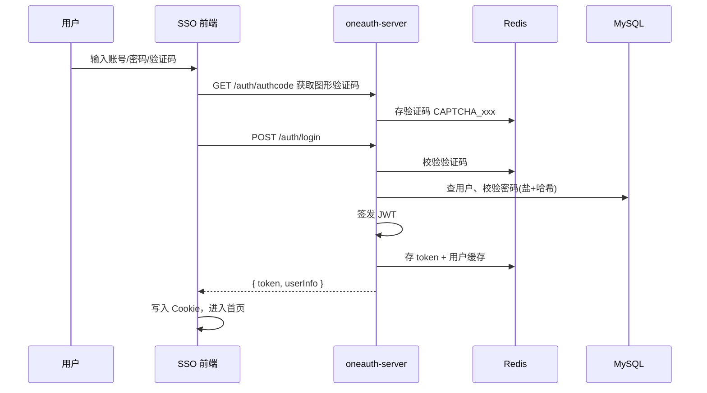

# 用 NestJS 搭建企业级 SSO：一套可落地的登录架构实践

> 本文基于真实生产项目抽象整理，已去除企业名称、域名、密钥等隐私信息。下文以 **OneAuth** 为项目代号（统一认证平台）。技术栈：**NestJS + MySQL + Redis + Nuxt 管理端**，适合作为内部统一登录中心（SSO）的参考实现。

---

## 一、为什么要做 SSO？

公司有多个后台/业务子系统，如果每个系统各自维护账号密码：

- 用户要记住多套凭证，体验差；
- 权限、离职冻结难以统一；
- 安全策略（验证码、限流、审计）重复建设。

因此抽出一套 **SSO 认证中心**：用户只在这里登录一次，各子系统通过 **Ticket** 或 **Token** 完成信任传递。

---

## 二、整体架构一览

```text
                    ┌─────────────────┐
                    │  OneAuth 门户   │  Nuxt，登录/应用门户
                    │ (oneauth-portal)│
                    └────────┬────────┘
                             │ HTTPS
                             ▼
┌──────────────┐    ┌─────────────────┐    ┌──────────────┐
│  业务子系统 A   │◄───│ oneauth-server  │───►│    MySQL     │
│  业务子系统 B   │    │  (NestJS)       │    │  用户/角色/应用 │
└──────────────┘    │  前缀: /oneauth  │    └──────────────┘
       ▲              └────────┬────────┘
       │ ticket 校验            │
       │                       ▼
       │              ┌─────────────────┐
       └──────────────│     Redis       │
          一次性 Ticket │ Token / Ticket  │
                      │ 验证码 / 用户缓存 │
                      └─────────────────┘
                             ▲
                             │ 应用 access_token（可选）
                      ┌──────┴──────┐
                      │ 第三方 IdP   │  如企业钉钉 OAuth
                      └─────────────┘
```

**角色划分：**


| 组件                 | 职责                                    |
| ------------------ | ------------------------------------- |
| **oneauth-server** | 认证、发 Token/Ticket、用户与角色、Ticket 校验 API |
| **oneauth-portal** | 登录页、应用列表、跳转子系统                        |
| **子系统**            | 只信任 SSO 颁发的 Ticket，不处理密码              |
| **Redis**          | 会话、一次性 Ticket、图形验证码                   |
| **MySQL**          | 用户主数据、应用注册、RBAC 关联                    |


---

## 三、两种「登录态」：Token 与 Ticket

这是理解本架构的关键。

### 3.1 JWT Token（给 SSO 控制台用）

用户密码登录或第三方登录成功后，SSO 签发 **JWT**，并写入 Redis：

```text
JWT.sign({ username, userId, realname, ... })
Redis.set(token, userJSON, TTL=7天)
```

前端将 Token 放在 Cookie，访问 `oneauth-server` 受保护接口时带：

```http
Authorization: Bearer <token>
```

**LoginGuard**（全局守卫）逻辑简述：

1. 接口若未标记 `@RequireLogin()` → 直接放行（如登录、验证码、OAuth 回调）；
2. 解析 JWT，失败返回 401；
3. 查 Redis `oneauth_cache_user_{username}`，若用户已冻结 → 401；
4. 将 `userId / username` 注入 `request.user`。

> 设计点：JWT 负责「是谁」，Redis 负责「是否仍有效/是否被冻结」，避免只验签名不验状态。

### 3.2 一次性 Ticket（给业务子系统用）

用户已在 SSO 登录后，要打开子系统 **不需要再输密码**：

```text
1. 前端调 GET /oneauth/auth/ticket（需已登录）
2. 服务端生成随机串 → MD5 → 前缀 ST_
3. Redis 存 ST_xxx → 用户 JSON，TTL 约 5 分钟
4. 浏览器跳转到: https://子系统.example.com?ticket=ST_xxx
5. 子系统后端调 SSO 校验接口，换取用户信息，并删除 Redis 中的 Ticket（一次性）
```

对应代码思路（已脱敏）：

```typescript
// 签发
const ticket = 'ST_' + md5(randomString);
await redis.set(ticket, JSON.stringify(user), 5 * 60);

// 校验（JSON 接口）
const userInfo = await redis.get(ticket);
await redis.del(ticket); // 用完即焚
return { username, realname, roleList, ... };
```

还支持 **CAS 风格 XML** 校验（`GET /p3/serviceValidate`），便于对接老系统。

**和 Token 的区别：**


|      | Token      | Ticket        |
| ---- | ---------- | ------------- |
| 生命周期 | 天级，可多次使用   | 分钟级，**用一次失效** |
| 使用方  | SSO 自身 API | 各业务子系统        |
| 传递方式 | Header     | URL 参数（跳转）    |


---

## 四、账号密码登录流程




**安全细节（简洁版）：**

- 图形验证码防暴力破解，校验后删除；
- 密码使用 **用户名 + 盐 + 自定义哈希**，不明文存储；
- 登录成功/失败写 **登录日志**（IP、结果）；
- 全局限流：60 秒内单 IP 最多 300 次请求（`ThrottlerGuard`）。

---

## 五、第三方登录（以钉钉 OAuth 为例）

密码登录之外，支持 **OAuth 2.0 授权码** 登录，减轻记密码成本。

```text
SSO 前端 → 钉钉授权页 → 回调页 /dingTalkLogin?code=...
       → GET /oneauth/auth/callback?code=...
       → 用 code 换 userAccessToken
       → 拉取钉钉用户身份（unionId → userid → 详情）
       → 按「工号 / 企业邮箱」匹配本地用户
       → 签发与密码登录相同的 JWT + Redis
```

要点：

- 使用 **企业内部应用** 的 `appKey / appSecret`，与用户扫码授权的 `code` 配合；
- 本地必须先有账号，**不会**根据钉钉自动注册（避免越权开户）；
- 第三方登录与 **人事同步**（在职/离职）共用应用凭证，但接口权限不同，需分别在开放平台申请。

---

## 六、子系统如何接入 SSO？

### 6.1 注册应用

在 `client_info` 表登记子系统：`clientCode`、`serverUrl`、`clientUrl` 等。

### 6.2 推荐跳转方式

1. 未登录访问子系统 → 重定向到 SSO，并带 `service` 参数（回跳地址）：
  ```text
   https://oneauth.example.com/login?service=https://app-a.example.com/callback
  ```
2. SSO 登录成功 → 前端根据 `service` 取 Ticket → 拼 URL 跳回：
  ```text
   https://app-a.example.com/callback?ticket=ST_XXXXX
  ```
3. 子系统服务端调用：
  ```http
   POST /oneauth/serviceValidate
   Body: { "ticket": "ST_XXXXX", "app": "app-a" }
  ```
   返回用户名、姓名、邮箱及 **在该应用下的角色列表**。

### 6.3 角色如何落到应用？

数据模型关系（简化）：

```text
用户 ── oneauth_user_role ── 系统角色(oneauth_sys_role)
                              ▲
                    oneauth_client_role（角色 ↔ 应用）
                              ▲
                         client_info（应用）
```

校验 Ticket 时按 `app`（clientCode）过滤，只返回该应用授权的角色，实现 **同一用户在不同系统权限不同**。

---

## 七、统一响应与鉴权装饰器

**全局拦截器** 将业务返回值包装为：

```json
{
  "code": 200,
  "success": true,
  "result": { ... },
  "timestamp": 1710000000000
}
```

**鉴权用法：**

```typescript
@RequireLogin()
@Get('ticket')
getTicket(@UserInfo('username') username: string) {
  return this.authService.getApplicationTicket(username);
}
```

未登录访问带 `@RequireLogin()` 的接口 → 401。

---

## 八、模块划分（oneauth-server）


| 模块              | 作用                        |
| --------------- | ------------------------- |
| `auth`          | 登录、登出、验证码、Ticket、OAuth 回调 |
| `validate`      | Ticket 校验、用户信息/角色查询       |
| `application`   | 接入应用 CRUD                 |
| `user` / `role` | 用户与权限管理                   |
| `email`         | 找回密码邮件                    |
| `dingtalk`（服务内） | OAuth 登录 + 可选人事同步定时任务     |


全局能力：`ConfigModule` 环境配置、`TypeORM`、Redis、`JwtModule`、`ScheduleModule` 定时任务。

---

## 九、可借鉴的设计取舍

1. **Token 管控制台，Ticket 管子系统**
  避免把长期 Token 放在 URL 里泄露；子系统只接触短命 Ticket。
2. **Ticket 一次性 + Redis 删除**
  降低重放风险；5 分钟 TTL 防止堆积。
3. **JWT + Redis 双轨校验**
  冻结用户可即时生效（查 Redis 状态），不必等 JWT 过期。
4. **OAuth 与账密登录出口一致**
  都返回 `LoginUserVo { token, userInfo }`，前端一套存 Cookie 逻辑。
5. **限流 + 验证码 + 登录日志**
  认证接口是攻击面，宜默认开启而不是后补。
6. **敏感能力走应用级 Token**
  登录用用户 OAuth Token；后台同步类任务用 `gettoken` 应用 Token，权限边界清晰。

---

## 十、本地调试清单（无隐私版）


| 配置项                                  | 说明             |
| ------------------------------------ | -------------- |
| `jwt_secret`                         | JWT 签名密钥，仅环境变量 |
| `mysql_`*                            | 用户库连接          |
| `redis_*`                            | 会话与 Ticket     |
| `OAUTH_APP_KEY` / `OAUTH_APP_SECRET` | 第三方应用凭证（示例名）   |
| `nest_server_port`                   | 服务端口           |


接口前缀：`http://localhost:{port}/oneauth/...`

---

## 十一、小结

这套 SSO 的核心不是「又一个登录接口」，而是三件事：

1. **统一认证入口**（账密 + OAuth）；
2. **两种凭证分工**（Token 自用、Ticket 外发）；
3. **可扩展的 RBAC 与多应用注册**。

如果你也在做 NestJS 中台，希望减少各系统重复登录逻辑，可以按本文的 Token/Ticket 双轨思路落地；第三方 IdP 可替换为飞书、企业微信等，整体模型不变。