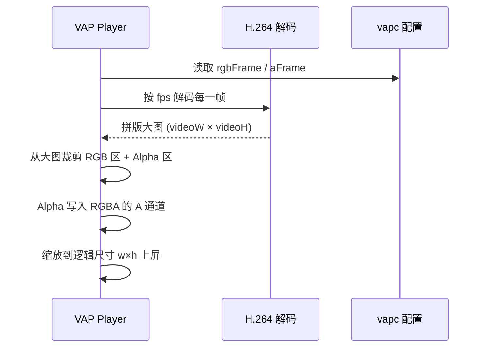
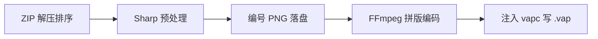

# 从序列帧 ZIP 到腾讯 VAP：原理拆解与 FFmpeg 拼版实战

> 适合掘金标签：`前端` `音视频` `FFmpeg` `动画` `Next.js`  
> 本文基于开源项目 [next-format-conversion](https://github.com/lbzlbss/next-format-conversion) 中的 `asset-convert` 管线，拆解 **序列帧 → VAP** 的完整原理与工程实现。

---

## 一、为什么需要 VAP？

动效素材在移动端很常见：红包雨、礼物特效、运营弹层。传统方案各有短板：


| 方案                | 优点     | 痛点                  |
| ----------------- | ------ | ------------------- |
| **GIF / APNG**    | 简单     | 体积大、色彩差、难硬件解码       |
| **纯 PNG 序列帧**     | 画质好    | 文件多、加载慢、内存峰值高       |
| **Lottie / SVGA** | 矢量、可交互 | 复杂特效表达力有限           |
| **透明视频 WebM**     | 浏览器友好  | iOS/Android 原生支持不一致 |


**VAP（Video Animation Player）** 是腾讯开源的特效播放方案（[Tencent/vap](https://github.com/Tencent/vap)），核心思路是：

> **把「带 Alpha 的动画」压进一条 H.264 视频里**，用 GPU 硬解播放；再用一份 **vapc 元数据** 告诉播放器：RGB 画面和 Alpha 蒙版在视频画面里的哪一块。

这样既享受 **视频编码的高压缩率**，又保留 **透明通道**，在 App 内是成熟方案。

---

## 二、VAP 文件到底是什么？

很多人第一次见 `.vap` 会疑惑：它是专有容器吗？

**实际上：`.vap` 本质就是 MP4（ISO Base Media）**，只是在 `moov` 里多了一个自定义 Box：`**vapc`**，内容是 UTF-8 JSON。

```
┌─────────────────────────────────────┐
│  MP4 容器 (ftyp + moov + mdat...)   │
│  ┌───────────────────────────────┐  │
│  │ vapc Box: JSON 配置            │  │
│  │  - info.w / info.h (逻辑尺寸)  │  │
│  │  - info.videoW / videoH (拼版) │  │
│  │  - rgbFrame / aFrame (裁剪区)  │  │
│  │  - fps / f (帧数)              │  │
│  └───────────────────────────────┘  │
│  视频轨: H.264, 每帧是「拼版后的画面」 │
└─────────────────────────────────────┘
```

播放器流程可以概括为：




**关键点**：透明信息并没有以「真·Alpha 视频轨」存储（H.264 也不方便），而是 **把 Alpha 画进视频的某个矩形区域**（通常是灰度图），播放时再合成。

---

## 三、拼版（Pack）的三种布局

腾讯工具链与社区实践里，常见三种 **RGB / Alpha 空间布局**（我们项目里叫 `pack`）：

### 3.1 `right` — 左右并排（最经典）

```
┌──────────────────┬──────────────────┐
│                  │                  │
│   RGB 彩色区      │  Alpha 灰度区     │
│   (w × h)        │  (w × h)         │
│                  │                  │
└──────────────────┴──────────────────┘
        videoW = 2w, videoH = h
```

- `rgbFrame = [0, 0, w, h]`
- `aFrame = [w, 0, w, h]`（在拼版坐标系里，x 从 w 开始）

FFmpeg `filter_complex` 思路：RGBA 拆成两路 → 一路提 Alpha 变灰度 → `hstack` 横拼。

### 3.2 `bottom` — 上下堆叠

```
┌──────────────────┐
│   RGB (w × h)    │
├──────────────────┤
│   Alpha (w × h)  │
└──────────────────┘
   videoW = w, videoH = 2h
```

适合某些编码器或素材比例；`aFrame` 的 y 偏移为 `h`。

### 3.3 `right-small` — 左大右小（行业常用）

右侧 **只有半宽**，且 Alpha 集中在 **右上角**，右下角留黑给融合/遮罩：

```
┌────────────────────┬─────────┐
│                    │ Alpha   │  ← 高度约 h/2
│   RGB              │ (缩窄)  │
│                    ├─────────┤
│                    │ 黑底预留 │
└────────────────────┴─────────┘
```

这样 **同样清晰度下，拼版宽度小于 2w**，码率更省。`vapc` 里会有 `alpha` 缩放系数（`alphaW / w`），播放器按 `aFrame` 采样 Alpha。

我们项目中的布局计算与滤镜生成集中在 `vap-pack.js`：

```javascript
// right 经典横拼
'[0:v]format=rgba,split=2[c0][c1];' +
'[c1]alphaextract,format=gray,format=rgb24[a];' +
'[c0]format=rgb24[c];' +
'[c][a]hstack=inputs=2[v]'

// right-small：Alpha 缩到半宽 + 下半黑底 + 再与 RGB hstack
`[c1]alphaextract,format=gray,scale=${alphaPlaneW}:${alphaTopH}...` +
'color=c=black:s=...' +
'[rgb][ar]hstack=inputs=2[v]'
```

---

## 四、序列帧 → VAP 的完整流水线

以「设计师导出 ZIP（多张 PNG）→ 服务端产出 `.vap`」为例，工程上通常分 **5 步**：




### 4.1 解压与自然排序

ZIP 内可能是 `001.png`、`frame_10.png` 混排，必须 **自然排序**（`frame_2` 在 `frame_10` 前），并跳过 `__MACOSX`、`._` 等垃圾条目。

### 4.2 Sharp：统一尺寸与对齐

每一帧要做的事：

1. **读入 RGBA**（PNG/WebP/GIF 等）
2. **resize**：`contain` / `cover` / `stretch` 到目标 `encW × encH`（偶数，H.264 友好）
3. **extend 到 padW × padH**：按 **16 像素对齐**（宏块对齐，减少编码伪影）
4. 输出统一 **PNG 序列** `%03d.png`

```javascript
sharp(buf).ensureAlpha()
  .resize(encW, encH, { fit: 'contain', background: { r:0,g:0,b:0,alpha:0 } })
  .extend({ right: padW - encW, bottom: padH - encH, ... })
  .png().toBuffer()
```

### 4.3 FFmpeg：图像序列 → 拼版 MP4

输入是图片序列，`**-framerate` 必须写在 input 侧**（image2  demuxer 约定）：

```bash
ffmpeg -framerate 30 -i frames/%03d.png \
  -filter_complex '... hstack ...' \
  -map '[v]' -c:v libx264 -pix_fmt yuv420p out.mp4
```

**为什么编码参数这么「怪」？** 这是 VAP 场景的经验值：


| 参数                       | 取值      | 原因                   |
| ------------------------ | ------- | -------------------- |
| `-g 1` / `-keyint_min 1` | 每帧都是关键帧 | 避免 P/B 帧在拼版边界产生色块/错位 |
| `-bf 0`                  | 无 B 帧   | 减少重排序，逐帧独立更稳         |
| `-preset veryfast`       | 速度优先    | Serverless 只有几百秒     |
| `-pix_fmt yuv420p`       | 最兼容     | 硬解友好                 |
| `-movflags +faststart`   | moov 前置 | 网络播放更快               |


透明通道在滤镜里已被「烤」进拼版画面，所以视频轨 **可以 `-an` 关音频**（若 ZIP Bundled 音频则 `-map` 音轨）。

### 4.4 生成 vapc 并写入 MP4

根据 `encW/encH/padW/padH/fps/帧数/pack` 生成 JSON：

```javascript
{
  "info": {
    "v": 2,
    "f": 120,
    "w": 720, "h": 720,
    "videoW": 1440, "videoH": 720,
    "fps": 30,
    "rgbFrame": [0, 0, 720, 720],
    "aFrame": [720, 0, 720, 720],
    "alpha": 1,
    "isVapx": 0,
    "sources": []
  }
}
```

然后在 MP4 二进制里 **查找已有 `vapc` box 或追加新 box**（`rebuildWithVapc`）：标准 MP4 box 头 8 字节 + JSON payload。

最终响应体文件名虽叫 `.vap`，**Content-Type 仍是 `application/octet-stream`**，浏览器预览时可从响应头 `X-Vapc-Config`（Base64）或文件内 box 解析配置。

---

## 五、播放器如何「拆」回透明动画？

逻辑与编码相反（我们前端 `VapToolInternal` / `parseVapcFromArrayBuffer` 同一套）：

对输出像素 `(ox, oy)`，在 **逻辑尺寸** `w × h` 内：

1. 归一化 `u = ox/w`, `v = oy/h`
2. 在拼版大图里找 **RGB 区** 对应像素 `(rx, ry)`
3. 在 **Alpha 区** 对应像素 `(ax, ay)`，取 **R 通道** 作为透明度（灰度存成 RGB 三通道相等）
4. 写出 `RGBA`

伪代码：

```javascript
outR = bigFrame[ry][rx].r
outG = bigFrame[ry][rx].g
outB = bigFrame[ry][rx].b
outA = bigFrame[ay][ax].r   // Alpha 区灰度在 R 通道
```

`right-small` 时 `aFrame` 只覆盖右上角，播放器仍按 `aFrame` 矩形做 UV 映射；`info.alpha` 告诉客户端 Alpha 相对 RGB 的缩放关系。

---

## 六、与 SVGA 的对比（同一条 ZIP 管线）

同一 ZIP 输入，选 `svga` 时会走 **另一条路**：帧图嵌进 SVGA 容器（ZIP + protobuf），**不做 H.264 拼版**。


| 维度  | VAP          | SVGA     |
| --- | ------------ | -------- |
| 载体  | MP4 + vapc   | ZIP 包    |
| 透明  | 视频拼版 + 播放器合成 | 矢量/位图精灵  |
| 体积  | 通常更小（视频压缩）   | 复杂特效可能更大 |
| 编辑  | 需重新编码        | 可逐精灵替换   |


选型建议：**重透明视频、要硬解** → VAP；**要矢量、可编辑图层** → SVGA。

---

## 七、在 Serverless（Vercel）上落地的真实约束

理论链路清晰，上线后才会撞墙。我们生产环境踩过的坑，值得写进「原理文的现实一章」：

### 7.1 时间：硬上限 300 秒（Hobby）

`export const maxDuration = 300` 是平台上限，**不是**你在代码里写 `withTimeout(540000)` 就能突破。大 ZIP（100MB+、数百帧、原图尺寸）很容易 **FUNCTION_INVOCATION_TIMEOUT**，客户端有时只看到 Vercel 通用 `500 Internal Server Error`。

**对策**：

- 转换前 **粗算耗时 / 磁盘 / 内存**（帧数 × 分辨率），超限直接 `408` + 中文提示，别傻等 300 秒
- 大任务强制用户填 **宽/高（如 720）**、减帧、拆 ZIP

### 7.2 磁盘：`/tmp` 约 512MB

回退稳定路径时，**每帧 PNG 落盘** + `out.mp4` 会顶满临时目录 → `ENOSPC`。

**对策**：减分辨率、减帧数；长期可探索 **image2pipe / rawvideo 管道** 少落盘（但要验证 ffmpeg 在 Lambda 上不退化挂死）。

### 7.3 请求体：4.5MB 硬顶

Vercel Serverless **无法**通过 `next.config` 把 HTTP body 提到 600MB。大 ZIP 必须 **Blob 直传 + JSON 调 API**（`blobUrl` + `expectedBytes`），绝不能 `curl -F` 硬 POST。

### 7.4 编码参数与画质

全 I 帧（`-g 1`）换稳定性，**码率会上升**；`crf` 18~23 需在体积与画质间权衡。`yuv420p` 对透明边缘略有色偏，是行业通用妥协。

---

## 八、最小可复现命令（理解用）

本地只有 `frames/%03d.png` 时，经典 **right** 拼版：

```bash
ffmpeg -y -framerate 30 -start_number 0 -i frames/%03d.png \
  -filter_complex "\
    [0:v]format=rgba,split=2[c0][c1];\
    [c1]alphaextract,format=gray,format=rgb24[a];\
    [c0]format=rgb24[c];\
    [c][a]hstack=inputs=2[v]" \
  -map "[v]" -c:v libx264 -preset veryfast -crf 20 \
  -g 1 -keyint_min 1 -sc_threshold 0 -bf 0 \
  -pix_fmt yuv420p -an -movflags +faststart out.mp4
```

再用腾讯 [vap-tool](https://github.com/Tencent/vap/tree/master/tool) 或自研脚本写入 `vapc`，重命名为 `.vap` 即可在 App 里试播。

---

## 九、总结


| 概念         | 一句话                                                                |
| ---------- | ------------------------------------------------------------------ |
| **VAP 本质** | 带 `vapc` 元数据的 MP4，不是神秘二进制                                          |
| **核心技巧**   | 把 Alpha「画」进视频的固定区域，硬解后再合成                                          |
| **拼版**     | `right` / `bottom` / `right-small` 决定 ffmpeg 滤镜与 `rgbFrame/aFrame` |
| **序列帧管线**  | 排序 → Sharp 对齐 → FFmpeg 编码 → 注入 vapc                                |
| **工程关键**   | 全 I 帧、无 B 帧、16 对齐、Serverless 预算预检                                  |


如果你在做 **Web 端素材工具 + 移动端特效下发**，搞懂这套拼版逻辑，比死记「导出 VAP 按钮」有用得多——**出问题時，先看 `vapc` 的 `videoW/videoH` 是否和 ffmpeg 拼出来的一致**，再看编码是不是引入了 B 帧。

---

## 参考

- [Tencent/vap](https://github.com/Tencent/vap) — 官方仓库与 vap-tool  
- [video-animation-player Web 版](https://github.com/Tencent/vap/tree/master/web)  
- 示例实现：`src/app/api/asset-convert/route.js`、`src/app/lib/vap-pack.js`、`src/app/lib/vapc-builder.js`、`src/app/lib/vap-mp4.server.js`

---

**作者说明**：文中 FFmpeg 滤镜与 vapc 字段与 MediaFlow / next-format-conversion 项目保持一致；若你的播放器是魔改分支，请以实际 `vapc` schema 为准。

欢迎在评论区交流：**你们线上用的是 right 还是 right-small？大 ZIP 一般压到多少分辨率？**