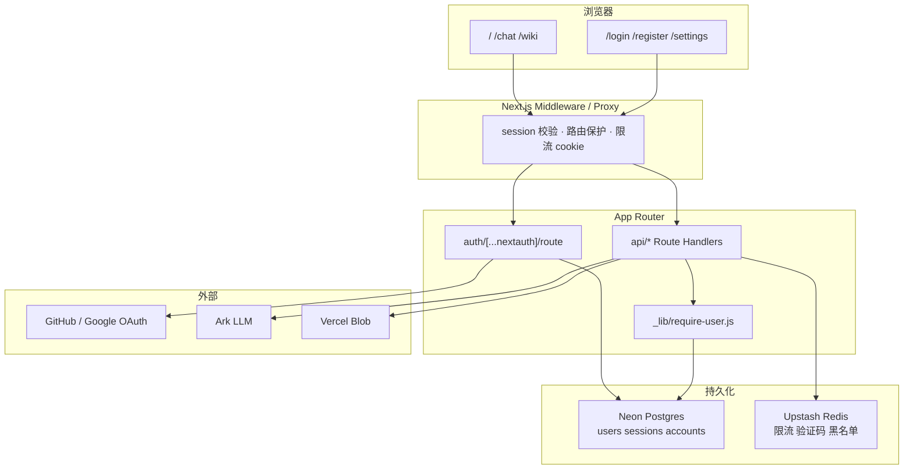
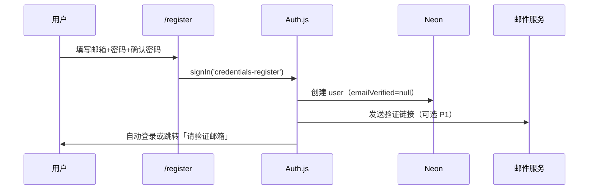
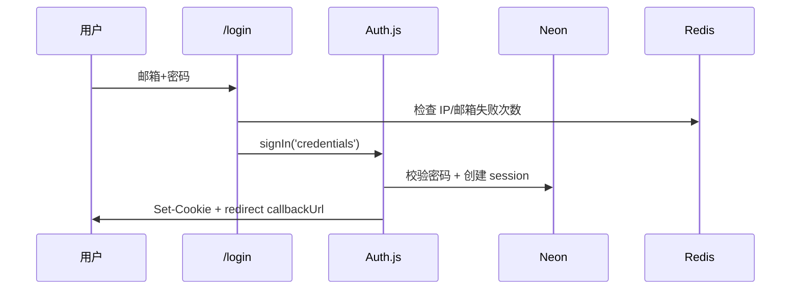

# MediaFlow 登录注册体系设计

> 面向 `next-format-conversion`（MediaFlow）· Next.js 16 App Router · Vercel 部署  
> 版本：**v1.1** · 2026-06-05（已落地配额 P0.5）  
> UI 规范：[design-system/mediaflow/pages/auth.md](../design-system/mediaflow/pages/auth.md)

---

## 1. 背景与目标

### 1.1 为什么要做登录

当前站点 **完全匿名**：所有转换 API、AI 对话、文生图、Vercel Blob 上传均无用户身份。带来的问题：

| 风险 | 说明 |
|------|------|
| 成本失控 | `ARK` 对话 / 文生图按 token 计费，易被刷量 |
| 算力滥用 | FFmpeg、Sharp 转换占用 Serverless 时长与内存 |
| 存储污染 | Blob 临时文件无用户维度，难追溯与清理 |
| 无法增值 | 无法做历史记录、配额套餐、付费能力 |
| 合规审计 | 命理/AI 内容缺少操作主体记录 |

### 1.2 设计目标

| 目标 | 指标 |
|------|------|
| 低摩擦 | 游客仍可使用核心工具（带限额）；登录后额度提升 |
| Vercel 原生 | 优先 Marketplace 集成（Neon、Upstash、Clerk 可选） |
| 安全默认 | HttpOnly Session、CSRF、密码哈希、登录限流 |
| 可扩展 | 预留 OAuth、企业 SSO（Ticket）、RBAC |
| UI 一致 | 复用 MediaFlow `mf-*` 与 Ant Design，见 auth 页面规范 |

### 1.3 非目标（首期不做）

- 微信支付 / 订阅计费完整闭环（仅预留 `plan` 字段）
- 多租户 B2B 管理后台
- 手机号 + 短信验证码（二期可选）

---

## 2. 现状盘点

```
src/app/
  layout.jsx          # 无用户态、无顶栏账号区
  page.jsx            # 首页工具，匿名
  chat/page.jsx       # AI 对话，匿名
  wiki/               # 公开只读
  api/**              # 19 个 Route Handler，均无 session 校验
```

| 能力 | 现状 |
|------|------|
| middleware | ❌ 不存在 |
| 数据库 | ✅ Neon（`neon-charcoal-horizon`），见 [setup-neon.md](./setup-neon.md) |
| Session | ❌ 仅 `sessionStorage` 存 ZIP 任务 |
| 鉴权 | 仅 `blob/cleanup` 用 `Bearer` 密钥 |

---

## 3. 用户分层与产品策略

采用 **渐进式认证（Progressive Auth）**，避免一上来全站登录墙。

| 层级 | 身份 | 能力 |
|------|------|------|
| L0 游客 | 无账号 | 文生图 **2 次/日**、AI 对话 **20 轮/日**、转换 30 次/日、Wiki 公开 |
| L1 注册用户 | 邮箱/OAuth | 文生图 20/日、对话 100/日、转换 200/日、历史云端（P2） |
| L2 订阅用户（预留） | `plan=pro` | 大文件、批量、优先队列、PDF 导出无水印 |
| L3 管理员 | `role=admin` | 用户管理、全站配额、审计日志 |

**登录墙策略：**

- **不强制登录**：`/`、`/wiki`、`/chat` 可访问
- **软门槛**：超额 / 大文件 / 文生图高频 → 弹窗引导注册
- **硬门槛（可选 P2）**：去水印、ZIP 批量等实验功能仅 L1+

---

## 4. 方案对比与推荐

### 4.1 候选方案

| 方案 | 优点 | 缺点 | 适用 |
|------|------|------|------|
| **A. Auth.js v5 + Neon** | 开源、自定义 UI、Credentials+OAuth、数据自持 | 需自建表、自己管安全细节 | **推荐主路径** |
| **B. Clerk** | Vercel Marketplace 一键、组件现成 | 定制 UI 受限、按 MAU 计费 | 快速 MVP / 小团队 |
| **C. 对接 OneAuth SSO** | 企业统一账号、Ticket 模型成熟 | 需独立 Nest 服务、过重 | 内网/多系统统一 |
| **D. 纯 JWT 自研** | 完全控制 | 易踩 CSRF/刷新/吊销坑 | 不推荐 |

### 4.2 推荐选型：**Auth.js v5（@auth/core）+ Neon Postgres + Upstash Redis**

理由：

1. 与 Next.js 16 App Router 官方推荐路径一致
2. Neon / Upstash 均为 Vercel Marketplace 一键绑定
3. 登录页可用 Ant Design 完全贴合 MediaFlow 视觉
4. Auth.js Adapter 直接管理 `users / accounts / sessions` 表
5. 后期可增 OAuth Provider，无需迁移用户

**快速通道：** 若 1 周内必须上线且不接自定义 UI，可并行评估 **Clerk**，架构文档第 12 节给出映射关系。

---

## 5. 系统架构



### 5.1 会话模型

| 项 | 方案 |
|----|------|
| Session 类型 | **Database Session**（Auth.js 默认，可吊销） |
| Cookie | `authjs.session-token`，`HttpOnly` `Secure` `SameSite=Lax` |
| 有效期 | 30 天滑动续期；「记住我」90 天 |
| 密码 | `bcrypt` cost=12 或 Argon2id |
| 刷新 | Auth.js 内置 session 更新，无需自研 refresh token |

### 5.2 与现有 SSO 文章的关系

仓库内 [SSO登录架构-掘金稿](./articles/SSO登录架构-掘金稿.md) 描述的是 **NestJS 企业 OneAuth**（JWT + 一次性 Ticket）。MediaFlow 作为 **独立 Vercel 子站**，首期走 Auth.js 本地用户；若未来接入企业 IdP：

```
用户 → OneAuth 登录 → Ticket → MediaFlow /api/auth/sso/callback
                              → 创建/绑定本地 user + Auth.js session
```

Ticket 校验接口与角色过滤可复用该文第 6 节模型，**不在首期实现**。

---

## 6. 数据模型

### 6.1 Auth.js 标准表（Neon）

由 `@auth/neon-adapter` 或 Drizzle schema 生成：

```sql
-- 核心（Auth.js 管理）
users          (id, name, email, emailVerified, image, created_at)
accounts       (userId, provider, providerAccountId, ...)  -- OAuth
sessions       (sessionToken, userId, expires)
verification_tokens  -- 邮箱验证 / 找回密码

-- 业务扩展（应用自建）
user_profiles  (user_id PK, display_name, avatar_url, locale)
user_plans     (user_id, plan: free|pro, expires_at)
usage_daily    (user_id, date, chat_count, convert_count, bytes_in)
audit_logs     (id, user_id, action, meta jsonb, ip, created_at)
```

### 6.2 用户扩展字段

```typescript
interface UserProfile {
  userId: string;
  plan: 'free' | 'pro';
  role: 'user' | 'admin';
  quota: {
    chatPerDay: number;
    maxUploadBytes: number;
    imageGenPerDay: number;
  };
}
```

注册完成时写入默认配额（`user` 档，见 `src/app/api/_lib/quota/constants.js`）。

### 6.3 已确认产品决策（v1.1）

| 问题 | 决策 |
|------|------|
| 游客文生图 | **每日 2 次试用**（UTC 日重置） |
| 游客 AI 对话 | 每日 20 轮 |
| 邮箱验证 | P1 可选，P2 文生图前强制 |
| 认证方案 | Auth.js + Neon（Clerk 不采用） |
| 企业 SSO | P4，对接 OneAuth Ticket |

### 6.4 配额实现（已落地 P0.5）

| 文件 | 职责 |
|------|------|
| `src/app/api/_lib/quota/constants.js` | 各 tier 日限额 |
| `src/app/api/_lib/quota/redis.js` | Upstash REST / dev 内存回退 |
| `src/app/api/_lib/quota/index.js` | `consumeQuota` / `getQuotaStatus` |
| `src/app/api/quota/usage/route.js` | `GET ?metric=imageGen` 查询剩余 |
| `src/app/api/_lib/auth/session.js` | 会话桩（待 Auth.js） |

已接入：`POST /api/generate-image`、`POST /api/chat`。超额返回 `429` + `code: QUOTA_EXCEEDED`。

**生产环境**须配置 Upstash REST 变量（Vercel 集成为 `KV_REST_API_URL` + `KV_REST_API_TOKEN`，或 `UPSTASH_REDIS_REST_*`），否则计费 API 返回 503。详见 [setup-upstash.md](./setup-upstash.md)。

---

## 7. 认证流程

### 7.1 邮箱注册



**校验规则：**

- 邮箱格式 + 唯一性
- 密码 ≥ 8 位，含字母与数字
- 注册限流：同 IP 5 次/小时（Redis）

### 7.2 邮箱登录



失败 ≥ 5 次 → 锁定 15 分钟（Redis key: `auth:lock:{email}`）。

### 7.3 OAuth（P1）

| Provider | 优先级 | 说明 |
|----------|--------|------|
| GitHub | P1 | 开发者用户契合度高 |
| Google | P2 | 需翻墙用户群体 |
| 微信 | P3 | 需企业资质与回调域名 |

按钮文案：「使用 GitHub 继续」，OAuth 首次登录自动 `users` + `accounts` 行。

### 7.4 找回密码（P1）

1. `/forgot-password` 提交邮箱  
2. 生成 `verification_token`（1h TTL）  
3. 邮件链接 → `/reset-password?token=...`  
4. 更新 `credentials` 密码哈希，吊销全部 `sessions`

---

## 8. 路由与 API 鉴权矩阵

### 8.1 页面路由

| 路径 | L0 游客 | L1 登录 | 说明 |
|------|---------|---------|------|
| `/` | ✅ | ✅ | 工具首页 |
| `/chat` | ✅ 限额 | ✅ | 对话 |
| `/wiki` | ✅ | ✅ | 公开 |
| `/login` | ✅ | redirect `/` | 已登录跳转首页 |
| `/register` | ✅ | redirect `/` | |
| `/settings` | ❌ → login | ✅ | 账号与配额 |
| `/settings/sessions` | ❌ | ✅ P2 | 设备管理 |

### 8.2 API Route Handlers

| API | 首期策略 | 登录后 |
|-----|----------|--------|
| `POST /api/chat` | 限流 IP | `userId` 配额 + 历史 |
| `POST /api/generate-image` | 限流 + 可选登录 | 计入 `imageGenPerDay` |
| `POST /api/convert-gif` 等转换 | 允许游客小文件 | 大文件需 L1 |
| `POST /api/blob/upload` | 游客限额 | Blob path 加 `users/{id}/` 前缀 |
| `GET /api/wiki/*` | 公开 | 公开 |
| `POST /api/blob/cleanup` | Bearer 密钥 | 仅 cron，不变 |

**守卫封装（拟建）：**

```javascript
// src/app/api/_lib/require-user.js
export async function requireUser(request, { optional = false } = {}) {
  const session = await auth();
  if (!session?.user?.id) {
    if (optional) return null;
    throw new ApiError(401, '请先登录');
  }
  return session.user;
}
```

### 8.3 Middleware（`src/middleware.js`）

```javascript
// 伪代码
const protectedPages = ['/settings'];
const protectedApi = []; // 首期 API 用 optional auth + 配额，middleware 仅保护页面

export function middleware(req) {
  const session = getToken(req);
  if (protectedPages.some(p => req.nextUrl.pathname.startsWith(p)) && !session) {
    return NextResponse.redirect(new URL(`/login?callbackUrl=...`, req.url));
  }
}
```

Next.js 16 若迁移 `proxy.ts`，逻辑等价迁移（见 Vercel routing-middleware skill）。

---

## 9. 限流与配额

### 9.1 Redis Key 设计

| Key | TTL | 用途 |
|-----|-----|------|
| `rl:ip:{ip}:chat` | 1d | 游客每日对话次数 |
| `rl:user:{id}:chat` | 1d | 登录用户对话 |
| `rl:ip:{ip}:register` | 1h | 注册防刷 |
| `auth:fail:{email}` | 15m | 登录失败计数 |

### 9.2 配额检查流程

```
API 入口
  → requireUser(optional)
  → getQuota(userId | guestIp)
  → 超限 → 429 + { code: 'QUOTA_EXCEEDED', upgradeUrl: '/register' }
  → 通过 → 执行业务 → incrementUsage
```

---

## 10. 前端信息架构

### 10.1 新增页面

| 路由 | 组件 | 说明 |
|------|------|------|
| `/login` | `LoginPage` | 邮箱 + OAuth |
| `/register` | `RegisterPage` | 注册 + 服务条款勾选 |
| `/forgot-password` | `ForgotPasswordPage` | |
| `/reset-password` | `ResetPasswordPage` | token 入参 |
| `/settings` | `SettingsPage` | 资料、配额、登出 |

UI 细则见 `design-system/mediaflow/pages/auth.md`。

### 10.2 全局用户态

```
src/app/
  providers/SessionProvider.jsx   # 客户端 useSession
  components/layout/UserMenu.jsx  # 首页顶栏 / chat 头栏头像下拉
```

**首页顶栏新增：**

- 未登录：`登录` `注册` 文字按钮
- 已登录：头像 + 下拉（设置、配额、退出）

### 10.3 对话页集成

- 超额时 `ChatPanel` 展示 `AuthPromptCard`（A2UI Card 或 Ant Alert）
- 登录后可选：会话历史列表（P2，`chat_sessions` 表）

---

## 11. 安全清单

| 项 | 措施 |
|----|------|
| 密码存储 | bcrypt/argon2，禁止明文 |
| Session 固定 | 登录成功后轮换 sessionToken |
| CSRF | Auth.js 内置 CSRF token |
| Cookie | `HttpOnly` `Secure` `SameSite=Lax` |
| 回调 URL | `callbackUrl` 白名单同源校验 |
| 邮件令牌 | 单次使用 + 短 TTL |
| 审计 | `audit_logs` 记录登录/登出/密码重置 |
| API 密钥 | `ARK_*` / `BLOB_*` 永不暴露客户端 |
| 头像上传 | 仅允许登录用户，走 Blob `users/{id}/avatar` |

---

## 12. Clerk 快速通道对照（可选）

若选用 Clerk 替代 Auth.js：

| 本设计概念 | Clerk 映射 |
|------------|------------|
| `users` 表 | Clerk User |
| Session | Clerk Session JWT |
| `/login` | `<SignIn />` 或 Account Portal |
| Middleware | `clerkMiddleware()` |
| 配额扩展 | Clerk `publicMetadata.plan` |
| Neon 业务表 | `userId = clerk.user.id` 外键（非 DB 外键，应用层关联） |

迁移成本：后期从 Clerk 迁出需导出用户，**中长期仍建议 Auth.js + Neon**。

---

## 13. 目录结构（拟建）

```
src/
  auth.js                          # Auth.js 配置 export { handlers, auth, signIn, signOut }
  middleware.js
  app/
    (auth)/
      login/page.jsx
      register/page.jsx
      forgot-password/page.jsx
      reset-password/page.jsx
    settings/page.jsx
    api/auth/[...nextauth]/route.js
    api/_lib/
      require-user.js
      quota.js
    providers/SessionProvider.jsx
    components/
      auth/
        AuthCard.jsx
        OAuthButtons.jsx
        AuthPromptCard.jsx
      layout/UserMenu.jsx
  lib/db/
    schema.ts                      # Drizzle：user_profiles, usage_daily, ...
    client.ts                      # Neon serverless
  lib/redis.ts                     # Upstash
```

---

## 14. 环境变量

| 变量 | 说明 |
|------|------|
| `AUTH_SECRET` | `openssl rand -base64 32` |
| `AUTH_URL` | 生产 `https://nextformat.aiblank.top` |
| `DATABASE_URL` | Neon pooled connection string（Vercel 集成已注入） |
| `NEON_PROJECT_ID` | Neon 项目 ID |
| `KV_REST_API_URL` | Vercel Upstash 集成自动注入（推荐） |
| `KV_REST_API_TOKEN` | 同上 |
| `UPSTASH_REDIS_REST_URL` | 手动创建 Upstash 时的别名 |
| `UPSTASH_REDIS_REST_TOKEN` | 同上 |
| `QUOTA_SALT` | 游客 actorId 哈希盐（可选） |
| `AUTH_GITHUB_ID` / `SECRET` | OAuth P1 |
| `AUTH_GOOGLE_ID` / `SECRET` | OAuth P2 |
| `RESEND_API_KEY` 或 `SMTP_*` | 邮件 P1 |

Vercel：Production / Preview 分别配置；Preview 可用 Neon branch。

---

## 15. 实施路线图

| 阶段 | 交付 | 工期（估） |
|------|------|-----------|
| **P0 设计冻结** | 本文档 + auth UI 规范 | ✅ |
| **P1 核心认证** | Auth.js、Neon、login/register、session、UserMenu | 3–4d |
| **P1.5 配额** | Redis 限流、chat/generate-image 接入 | 2d |
| **P2 体验** | OAuth GitHub、找回密码、settings 页 | 2–3d |
| **P3 增值** | 对话历史、plan 字段、软登录墙 A2UI | 3–5d |
| **P4 企业** | OneAuth Ticket SSO 回调 | 5d+ |

### P1 任务拆解

1. `pnpm add next-auth@beta @auth/drizzle-adapter drizzle-orm @neondatabase/serverless bcrypt`
2. Drizzle schema migrate（Neon）
3. `auth.js` + `[...nextauth]/route.js`
4. `/login` `/register` 页面（Ant Design Form）
5. `SessionProvider` + `UserMenu`
6. `requireUser` 接入 `POST /api/chat`（optional → 限额区分）
7. Vercel 环境变量与 Preview 验证

---

## 16. 验收标准

- [ ] 游客可浏览首页、Wiki、有限次对话
- [ ] 注册后 Cookie 会话保持，刷新页面仍登录
- [ ] 登出后 session 从 DB 删除，Cookie 清除
- [ ] 错误密码 5 次锁定，Redis 可观测
- [ ] `/settings` 未登录跳转 `/login?callbackUrl=...`
- [ ] 登录后顶栏展示用户菜单
- [ ] `POST /api/chat` 游客超限返回 429 与引导文案
- [ ] 密码不以明文出现在日志与响应中
- [ ] Lighthouse /chat 登录墙不阻塞首屏（登录为独立路由）

---

## 17. 开放问题

1. ~~游客文生图额度~~ → **已确认：2 次/日**  
2. **邀请码 / 内测 gating？** 待定  
3. **图生图模式是否计入同一 imageGen 配额？** 当前：是（同一 metric）  

---

**维护**：MediaFlow 前端 · 账号体系  
**关联**： [llm-wiki-architecture.md](./llm-wiki-architecture.md)（登录后可存对话历史并个性化 Wiki 推荐，P3）
