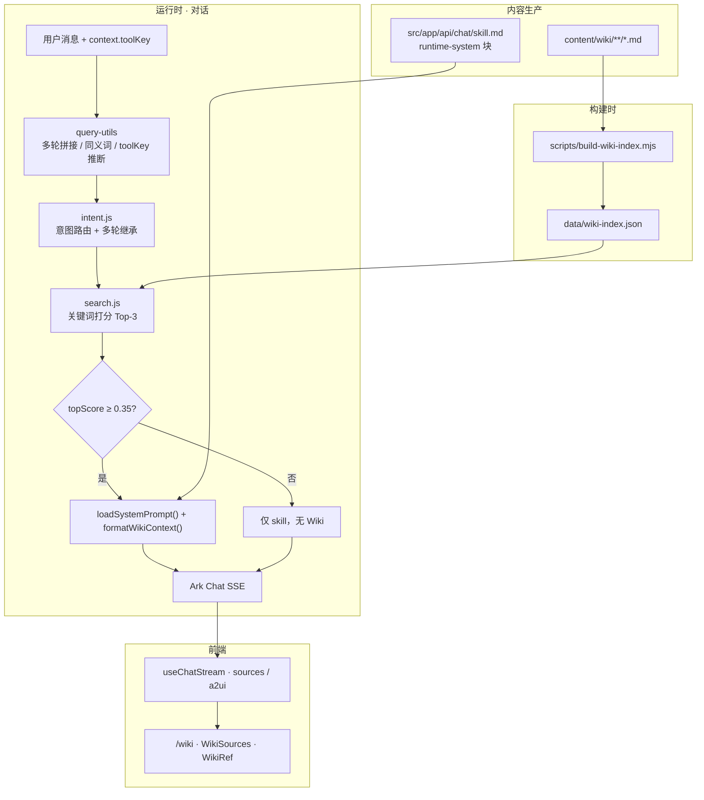

# LLM Wiki 知识库架构

> MediaFlow 项目 · 将站点操作手册、工具参数、命理参考以 **Markdown Wiki + RAG** 接入 AI 对话助手。  
> 版本：**v2.0** · 更新：2026-06-05  
> 关联需求设计：[llm-wiki-design.md](./llm-wiki-design.md)

---

## 1. 目标与原则

| 目标 | 说明 |
|------|------|
| 准确作答 | 工具参数、操作步骤以 Wiki 为准，减少模型幻觉 |
| 可维护 | 运营改 Markdown + `pnpm wiki:build`，无需改 `route.js` |
| 低成本 | 首期关键词检索 + 规则扩展，无向量库依赖 |
| 可观测 | 检索返回 `intent`、`topScore`，便于排错 |

**设计原则：**

- **人设与格式** → `skill.md` 运行时块（`loadSystemPrompt`）
- **事实与步骤** → `content/wiki/**/*.md`，RAG 按需注入
- **低置信不注入** → `topScore < 2.0` 时不拼参考资料，避免硬编

---

## 2. 系统总览



---

## 3. 目录结构

```
content/wiki/                    # 源文档（Markdown + YAML frontmatter）
  _meta.json                     # 分类元数据
  getting-started/               # 入门、A2UI 说明
  tools/                         # 各工具操作手册
  ai/                            # Prompt、视频参数
  fortune/                       # 命理断语、书目

data/wiki-index.json             # 构建产物（articles + chunks）

scripts/
  build-wiki-index.mjs           # 扫描 MD → 索引
  ensure-wiki-index.mjs          # dev 启动时按需重建

src/app/api/
  chat/
    route.js                     # 对话主入口：检索 + SSE
    skill.md                     # 人设文档 + runtime-system 块
    _lib/load-system-prompt.js   # 读取 runtime 块
  _lib/wiki/
    load-index.js                # 索引加载（内存缓存 + mtime）
    search.js                    # 检索、格式化、sources
    intent.js                    # 意图检测与多轮继承
    query-utils.js               # query 扩展、多轮拼接、toolKey 推断
  wiki/
    search/route.js              # GET 检索 API（调试 / 前端搜索）
    articles/route.js            # 文章列表 API

src/app/wiki/                    # Wiki 浏览页
src/app/components/wiki/         # Markdown 渲染、目录
src/app/components/chat/WikiSources.jsx
src/app/lib/a2ui/build-wiki-sources-surface.js
```

---

## 4. 内容模型

### 4.1 文章 Frontmatter

```yaml
---
title: GIF 转 WebP
slug: gif-to-webp
category: tools          # getting-started | tools | ai | fortune
tags: [gif, webp, 压缩]
toolKey: gifToWebp       # 与首页 / chat registry 对齐，检索加权
updatedAt: 2026-06-05
---
```

### 4.2 分块策略（`build-wiki-index.mjs`）

| 规则 | 值 |
|------|-----|
| 一级切分 | `##` 二级标题 |
| 二级切分 | `###` 三级标题（heading 记为 `H2 > H3`） |
| 超长窗口 | 单块 > 1000 字按段落滑窗切分（重叠 120 字） |
| 安全 | 构建时 `stripHtml` 去除 HTML/script |
| Chunk ID | `{slug}#{anchor}`，多段为 `{slug}#{anchor}-2` |

### 4.3 索引 JSON 结构

```json
{
  "version": 1,
  "builtAt": "2026-06-05T...",
  "categories": [...],
  "articles": [{ "slug", "title", "category", "tags", "toolKey", "markdown", ... }],
  "chunks": [{ "id", "slug", "title", "heading", "category", "tags", "toolKey", "content" }]
}
```

索引放在 **`data/`** 而非 `public/`，避免 dev 写入 public 触发整页 HMR 刷新。

---

## 5. 检索层

### 5.1 流水线

```
原始 query
  → buildRetrievalQuery(messages)     # 最近 3 轮 user 拼接
  → expandWikiQuery()                 # 口语同义词扩展
  → resolveWikiIntent(query, messages) # 意图 + 多轮继承
  → 按 category 过滤 chunk 池
  → scoreChunk() 打分排序
  → MIN_SCORE=0.12 过滤候选
  → topScore < MIN_TOP_SCORE=2.0 → 返回空 chunks（不注入）
  → Top-3 去重（slug::heading）
```

### 5.2 打分公式（关键词 MVP）

对每条 chunk 累加：

| 信号 | 权重 |
|------|------|
| 完整 query 命中 title | +3 |
| 命中 tags | +2 |
| 命中 body | +1.5 |
| 单 token 命中 title / tags / body | +1.2 / +0.8 / +0.5 |
| `toolKey` 与 chunk.toolKey 一致 | +0.35 |
| 长度归一化 | `× 1/√(1+len/500)` |

### 5.3 意图路由

| intent | 检索范围 |
|--------|----------|
| `fortune` | `fortune` |
| `ai` | `ai` + `tools` |
| `tools` | `tools` + `getting-started` |
| `chitchat` | 不检索 |
| `general` | 全库（无 category 过滤） |

**多轮继承：** 当前句为 `general` / 短追问时，向上查找最近 user 句的 intent 并复用（如「那质量呢？」继承 `tools`）。

### 5.4 toolKey 来源（优先级）

1. 客户端 `context.toolKey`（首页工具页、ChatPanel）
2. `useChatComposer` 根据已选 chat tool / 附件类型传入
3. `inferWikiToolKey(retrievalQuery)` 文本推断

### 5.5 上下文注入预算

- `formatWikiContext` 总字符上限：**2800**（含头尾说明）
- Top-K：**3** chunks
- 超出预算时截断最后一块并加 `…`

---

## 6. 对话 API 集成

### 6.1 请求

`POST /api/chat`

```json
{
  "messages": [{ "role": "user", "content": "GIF 转 WebP 质量怎么设" }],
  "context": {
    "toolKey": "gifToWebp",
    "useWiki": true
  }
}
```

### 6.2 System Prompt 组装

```
loadSystemPrompt()          ← skill.md <!-- runtime-system --> 块，{{siteName}} 替换
+ formatWikiContext(chunks) ← 仅 topScore 达标时追加【参考资料】
```

### 6.3 SSE 事件

| event | 说明 |
|-------|------|
| `sources` | `{ items: [{ slug, title, anchor? }] }`，Wiki 参考链接 |
| `a2ui` | 参数表单 / 工具结果 / WikiRef Surface |
| `thinking` | 模型 reasoning |
| `content` | 正文流 |
| `done` | 结束 |

前端 `useChatStream` 将 `sources` 写入 message，由 `WikiSources` 或 A2UI `WikiRef` 渲染。

---

## 7. 检索 API（调试）

`GET /api/wiki/search?q=...&limit=3&toolKey=gifToWebp&useWiki=true`

```json
{
  "chunks": [{ "slug", "title", "heading", "content", "score", "category" }],
  "intent": "tools",
  "topScore": 1.42
}
```

`Cache-Control: public, s-maxage=60`

---

## 8. 前端 Wiki 浏览

| 路由 | 说明 |
|------|------|
| `/wiki` | 分类索引 |
| `/wiki/[slug]` | 单篇 Markdown 渲染 + 目录锚点 |

首页工具区通过 `WIKI_SLUG_BY_TOOL` 映射 `toolKey → slug`，展示「查看操作说明」链接。

聊天参考链接格式：`/wiki/{slug}#{anchor}`，`anchor` 由 chunk heading 的叶子标题 slugify 生成。

---

## 9. 工具文档覆盖（toolKey ↔ slug）

| toolKey | Wiki slug | 对话可执行 |
|---------|-----------|------------|
| gifToWebp | gif-to-webp | ✅ |
| gifCompress | gif-compress | ✅ |
| gifToMp4 | gif-to-mp4 | ✅ |
| mp4Compress | mp4-compress | ✅ |
| mp4FirstFrame | mp4-first-frame | ✅ |
| imageCompress | image-compress | ✅ |
| imageGenerate | image-generate | ✅ |
| svgaTool | svga-tool | 首页 |
| vapTool | vap-tool | 首页 |
| videoWatermark | video-watermark | 首页 |
| assetZipConvert | asset-zip-convert | 首页 |

补充说明：`getting-started/a2ui-guide` 介绍参数表单与 A2UI 开关。

---

## 10. 构建与部署

| 命令 | 时机 |
|------|------|
| `pnpm wiki:build` | 手动 / CI |
| `pnpm dev` | 启动前 `ensure-wiki-index`（仅当 MD 比索引新） |
| `pnpm build` | `wiki:build` → `next build` |

**新增/修改 Wiki 流程：**

1. 编辑 `content/wiki/**/*.md`
2. 运行 `pnpm wiki:build`
3. 提交 `content/wiki` + `data/wiki-index.json`（或由 CI 构建）

---

## 11. 环境变量（相关）

| 变量 | 作用 |
|------|------|
| `ARK_API_KEY2` | 对话模型 |
| `ARK_CHAT_MODEL` | 默认 `deepseek-v4-flash` |
| `NEXT_PUBLIC_A2UI_ENABLED` | `0` 回退 ToolResultCard |
| `NEXT_PUBLIC_A2UI_PARAM_FORM` | `0` 关闭参数表单 |
| `A2UI_LLM_ENABLED` | `1` 开启 LLM 生成 A2UI |

Wiki 检索本身 **不依赖** 额外 API Key。

---

## 12. 安全

| 风险 | 对策 |
|------|------|
| MD 内嵌 HTML/脚本 | 构建时 `stripHtml` |
| Prompt 注入 | 参考资料块要求「勿编造未出现内容」 |
| 上下文过长 | 2800 字符预算 + Top-3 |
| 低相关硬注入 | `MIN_TOP_SCORE=2.0` 门控 |

---

## 13. 验收用例

| 用户输入 | 期望 |
|----------|------|
| `GIF 转 WebP 质量怎么设` | 命中 `gif-to-webp`，回答含 quality 范围 |
| `动图变小` | 命中 `gif-compress` |
| 上轮 GIF WebP + `那质量呢？` | 仍命中 `gif-to-webp`（多轮 + 意图继承） |
| `VAP 花屏怎么办` | 命中 `vap-tool` |
| `你好` | 不检索，`chunks=[]` |
| 完全无关长文 | `topScore < 2.0`，不注入 Wiki |

本地快速验证：

```bash
pnpm wiki:build
node --input-type=module -e "
import { searchWiki } from './src/app/api/_lib/wiki/search.js';
const r = await searchWiki('动图变小');
console.log(r.intent, r.topScore, r.chunks.map(c=>c.slug));
"
```

---

## 14. 演进路线（未实现）

| 阶段 | 内容 | 收益 |
|------|------|------|
| **P2** | Ark Embedding + 混合检索（0.7 向量 + 0.3 关键词） | 口语召回质变 |
| **P2** | 标准 BM25 替代手写加权 | 长文档稳定性 |
| **P3** | `/wiki` 全文搜索 UI | 运营校对效率 |
| **P3** | 检索日志（query / score / chunks） | bad case 分析 |
| **P4** | CMS / material-api 对接 | 非研发改文案 |
| **运维** | chokidar watch `content/wiki` 热重建 | dev 体验 |

---

## 15. 新增一篇 Wiki 检查清单

- [ ] frontmatter 含 `title`、`slug`、`category`
- [ ] 工具类补 `toolKey`，与 `registry.js` / 首页 key 一致
- [ ] 用 `##` / `###` 组织，单节不宜过长
- [ ] `pnpm wiki:build` 后确认 chunk 数量合理
- [ ] 首页 `WIKI_SLUG_BY_TOOL` 补映射（如有对应工具）
- [ ] 用 `/api/wiki/search?q=...` 或对话实测召回

---

## 16. 关键代码索引

| 模块 | 路径 |
|------|------|
| 索引构建 | `scripts/build-wiki-index.mjs` |
| 检索入口 | `src/app/api/_lib/wiki/search.js` |
| 意图 | `src/app/api/_lib/wiki/intent.js` |
| Query 工具 | `src/app/api/_lib/wiki/query-utils.js` |
| 对话接入 | `src/app/api/chat/route.js` |
| System Prompt | `src/app/api/chat/_lib/load-system-prompt.js` |
| 人设文档 | `src/app/api/chat/skill.md` |
| Chat 工具注册 | `src/app/lib/chat-tools/registry.js` |

---

**维护者**：MediaFlow 前端 · 对话与知识库模块  
**上一版设计文档**：[llm-wiki-design.md](./llm-wiki-design.md)（需求与路线图原文）
