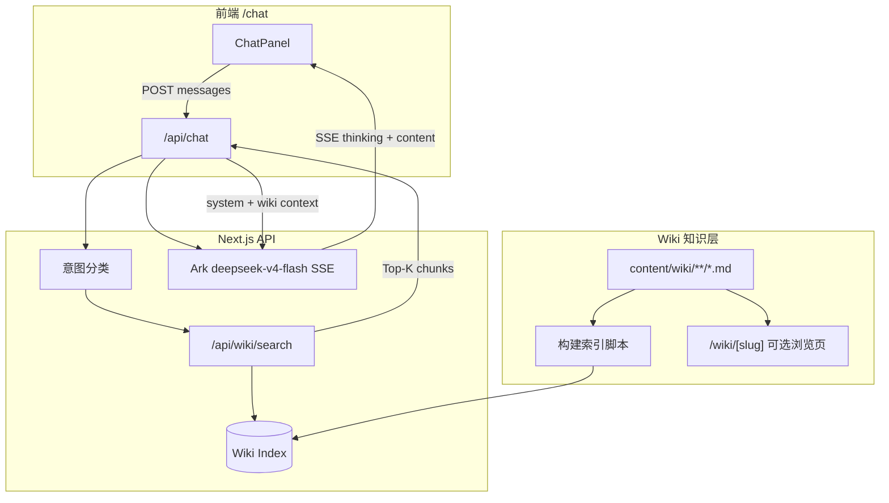

# LLM Wiki 接入设计方案

> 面向 `next-format-conversion` 项目，将站点操作手册、工具参数说明、命理断语库等知识以 **Wiki + RAG** 方式接入 AI 对话助手，提升回答准确性与可维护性。

---

## 1. 背景与目标

### 现状

- System Prompt 内联在 `api/chat/route.js` 的 `buildSystemPrompt()`，完整规范在 `api/chat/skill.md` 但**运行时未读取**。
- 知识更新需改代码或重新部署，无法按工具/场景增量维护。
- 无引用溯源，用户无法核对「助手依据哪篇文档作答」。

### 目标

| 目标 | 说明 |
|------|------|
| 可维护 | 运营/开发通过 Markdown Wiki 更新，无需改 Prompt 代码 |
| 可检索 | 用户提问时自动召回 Top-K 相关片段注入上下文 |
| 可溯源 | 回复可附带「参考文档」链接（Wiki  slug / 锚点） |
| 低成本 | 首期用本地 Markdown + 关键词/向量检索，避免重型 CMS |

---

## 2. 总体架构



### 数据流（单次对话）

1. 用户发送 `messages` → `POST /api/chat`
2. 服务端取最后一条 user 消息 → 调用 Wiki 检索
3. 将检索结果格式化为 `【参考资料】` 块，追加到 system 或单独 `role: system` 消息
4. 调用 Ark `deepseek-v4-flash` 流式推理
5. SSE 返回 `thinking` / `content`；可选在最后一条 `content` 事件附带 `sources: [{ slug, title }]`

---

## 3. Wiki 内容模型

### 目录结构（建议）

```
content/wiki/
├── _meta.json                 # 分类、标签、排序
├── getting-started/
│   └── index.md               # 站点概览
├── tools/
│   ├── gif-to-webp.md
│   ├── mp4-compress.md
│   ├── image-generate.md
│   └── svga-tool.md
├── ai/
│   ├── prompt-guide.md        # Prompt / ControlNet / Seed
│   └── video-params.md        # 运动强度、重绘、FPS
└── fortune/
    └── phrases.md             # 断语库（命理场景）
```

### Frontmatter 规范

```yaml
---
title: GIF 转 WebP
slug: gif-to-webp
category: tools
tags: [gif, webp, 压缩]
toolKey: gifToWebp          # 与 page.jsx nav key 对齐，便于「当前工具」加权
updatedAt: 2026-05-19
---
```

### 分块策略（Chunking）

- 按 `##` 二级标题切分，每块 300–800 字
- 保留 `title + slug + heading` 作为 chunk 元数据
- 块 ID：`{slug}#{heading-anchor}`

---

## 4. 检索层设计

### 阶段一：关键词 + 标签（MVP，1–2 天）

| 项 | 方案 |
|----|------|
| 索引 | 构建时生成 `public/wiki-index.json`（或 `.next/wiki-index.json`） |
| 检索 | BM25 或简单 TF-IDF；匹配 title、tags、正文 |
| 触发 | 每条 user 消息检索 Top-3 |
| 注入 | system 末尾追加 `\n\n【参考资料】\n{chunks}` |

**优点**：无额外服务、可离线构建。  
**缺点**：同义词、口语化问法召回弱。

### 阶段二：向量检索（推荐生产）

| 项 | 方案 |
|----|------|
| Embedding | Ark Embedding API 或 `text-embedding-3-small` 兼容接口 |
| 存储 | 本地 JSONL / SQLite-vec / Upstash Vector（Vercel 友好） |
| 混合检索 | `0.7 * 向量分 + 0.3 * BM25` |
| 过滤 | `category=tools` 且 `toolKey` 与 Referer 或客户端传的 `context.toolKey` 一致时加权 |

### 阶段三：意图路由（可选）

轻量规则或一次小模型调用，将问题分为：

- `tool_ops` → 只检索 `tools/*`
- `ai_creation` → `ai/*`
- `fortune` → `fortune/*`
- `chitchat` → 不检索或仅检索 `getting-started`

减少无关 chunk 污染上下文。

---

## 5. API 设计

### 5.1 `GET /api/wiki/search?q=...&limit=3`

**响应示例：**

```json
{
  "chunks": [
    {
      "slug": "gif-to-webp",
      "title": "GIF 转 WebP",
      "heading": "质量参数说明",
      "content": "...",
      "score": 0.82
    }
  ]
}
```

### 5.2 `POST /api/chat` 扩展

**请求扩展（可选）：**

```json
{
  "messages": [...],
  "context": {
    "toolKey": "gifToWebp",
    "useWiki": true
  }
}
```

**服务端伪代码：**

```javascript
const chunks = await searchWiki(lastUserContent, { toolKey: context?.toolKey });
const wikiBlock = formatWikiContext(chunks);
const systemPrompt = buildSystemPrompt() + wikiBlock;
// ... 现有 Ark SSE 逻辑
```

**SSE 扩展（可选）：**

```
event: sources
data: {"items":[{"slug":"gif-to-webp","title":"GIF 转 WebP"}]}

event: content
data: {"content":"..."}
```

前端在 assistant 气泡底部渲染「参考：GIF 转 WebP」链接，指向 `/wiki/gif-to-webp`。

---

## 6. 与现有代码的集成点

| 文件 | 改动 |
|------|------|
| `src/app/api/chat/route.js` | 在 `buildSystemPrompt` 后拼接 Wiki 上下文；`done` 前可选推送 `sources` 事件 |
| `src/app/api/_lib/ark.js` | 已有模型配置，无需变更 |
| `src/app/hooks/useChatStream.js` | 解析 `sources` 事件，写入 message.meta |
| `src/app/components/chat/ChatPanel.jsx` | 展示参考链接 |
| `scripts/build-wiki-index.mjs` | 新建：扫描 `content/wiki`，输出索引 |
| `src/app/wiki/[slug]/page.jsx` | 可选：静态 Wiki 浏览页（MDX / marked） |

**与 `skill.md` 的关系：**

- `skill.md` 降级为「人设 + 输出格式」的**主 System Prompt**
- 具体操作步骤、参数表迁入 Wiki，由 RAG 按需注入
- 避免 system 过长导致每轮 token 浪费

---

## 7. Prompt 组装规范

```
[System]
{skill 精简版：身份、格式、约束}

【参考资料】（仅当检索命中时注入，勿编造未出现的内容）
---
[1] GIF 转 WebP > 质量参数说明
{chunk content}
---
[2] ...

若资料不足以回答，请明确说明并给出通用建议。

[User/Assistant 历史...]
```

**约束：**

- 明确要求模型**优先依据参考资料**，冲突时以 Wiki 为准
- 命理类仍走 `fortune/phrases.md`，禁止编造断语

---

## 8. 前端 Wiki 浏览（可选）

- 路由：`/wiki`、`/wiki/[slug]`
- 侧边栏与首页工具 `toolKey` 互链：「查看操作说明 →」
- 聊天页 `/chat` 增加「知识库」入口，方便运营校对

---

## 9. 构建与部署

| 步骤 | 命令 / 时机 |
|------|-------------|
| 索引构建 | `pnpm wiki:build` → 写入 `data/wiki-index.json`（非 public，避免 dev 整页刷新） |
| CI | `build` 前执行 `wiki:build` |
| 热更新 | 开发环境 watch `content/wiki`，重启 dev 或 chokidar 重建索引 |
| 缓存 | 检索 API `Cache-Control: s-maxage=60`；索引文件带 hash |

`package.json` 脚本示例：

```json
{
  "scripts": {
    "wiki:build": "node scripts/build-wiki-index.mjs"
  }
}
```

---

## 10. 安全与成本

| 风险 | 对策 |
|------|------|
| Prompt 注入（恶意 MD） | 构建时 strip HTML；检索结果仅纯文本 |
| 上下文过长 | Top-K=3，每 chunk max 600 tokens，总 Wiki 注入 ≤ 1500 tokens |
| API 成本 | 意图路由 + 低置信度不检索；命理/闲聊可跳过 |
| 密钥 | Wiki 构建无需密钥；仅 chat 走 `ARK_API_KEY2` |

---

## 11. 实施路线图

| 阶段 | 交付 | 工期（估） |
|------|------|-----------|
| P0 | `content/wiki` 目录 + 3 篇工具文档 + `wiki:build` + 关键词检索 | 2d |
| P1 | `chat/route` 接入检索注入；聊天页展示 sources | 1d |
| P2 | 向量检索 + `toolKey` 加权 | 3d |
| P3 | `/wiki/[slug]` 浏览页 + 与首页互链 | 2d |
| P4 | 意图路由 + 运营后台（可选，接 material-api CMS） | 5d+ |

---

## 12. 验收标准

- [x] 问「GIF 转 WebP 质量设多少」能召回 `gif-to-webp.md` 且回答含正确参数范围
- [x] 问与站点无关问题，不强行编造 Wiki 内容（低分不注入 + Prompt 约束）
- [x] 流式回复仍支持 `thinking` + `content` SSE
- [x] 更新 Wiki Markdown 后执行 `wiki:build` 即可生效，无需改 `route.js`
- [x] 回复底部展示参考文档链接且可点击

---

## 13. 参考实现片段

### Wiki 上下文格式化

```javascript
function formatWikiContext(chunks) {
  if (!chunks?.length) return "";
  const body = chunks
    .map(
      (c, i) =>
        `[${i + 1}] ${c.title}${c.heading ? ` > ${c.heading}` : ""}\n${c.content}`,
    )
    .join("\n---\n");
  return `\n\n【参考资料】\n${body}\n\n请优先依据上述资料回答；资料不足时请说明。`;
}
```

### 检索 API 骨架

```javascript
// src/app/api/wiki/search/route.js
import { loadWikiIndex } from "../../_lib/wiki-index";

export async function GET(request) {
  const q = new URL(request.url).searchParams.get("q") ?? "";
  const limit = Number(new URL(request.url).searchParams.get("limit") ?? 3);
  const index = await loadWikiIndex();
  const chunks = index.search(q, { limit });
  return Response.json({ chunks });
}
```

---

**文档版本**：v1.0 · 2026-05-19  
**关联实现**：`/chat` 独立页、SSE 流式、`ARK_CHAT_MODEL=deepseek-v4-flash`
